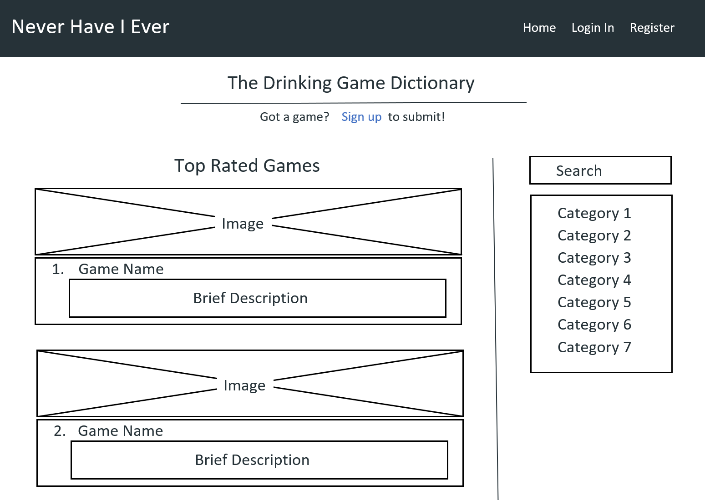
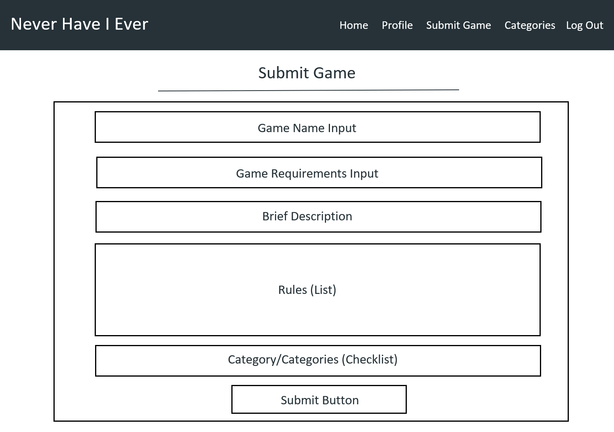

# Never Have I Ever - The Drinking Game Dictionary 

I will plan, code and implement a website for an index of Drinking Games. The website will be linked to a database, containing all of the games, the categories and users associated with it. A user must be able to view existing games, as well as creating, editing and deleting database entries depending on the user's account priviledges.

## UX

The website will have be targetted at young adults and students.

- Users will be able to view games in various categories. They will be able to see the requirements of games, regarding equipment needed, and also see the rules.

- Registered users will have the ability to submit new games and upvote games to create a rating system.

- Admin and users with admin priveledges will have the ability to edit and delete games, as well as creating, editing and deleting categories.

#### User Stories

- "I need a way of finding new drinking games for a party. I need a large choice of games, with the rules written down all in one place. Having the games in categories is needed to ensure we can find the type of game the group would like"

- "I have many original games that I would like to submit. These are games I have developed myself as well as games tought to me over many years. These are games that need to be documented. I also believe I have versions of well known games that are more fun and entertaining than the well known version."

- "As an admin of the website, I need a way to vet the submitions, ensuring the authenticity, quality and originality of games on the website. I also need the ability to edit and delete games if needed. I also need the ability to create, update and delete the categories."

---

#### Mockups

Wireframes were drawn to assertain how the layout of the website will fit together:

Home Page


Add Game Page


---

## Features

### Existing Features

Navigation bar:
- A regular user will see links to the Home Page, Register or to Log In.
- A registered user who is logged in will see links to the Home Page, Submit Game, Profile Page and Log Out.
- An Admin will see the same as a registered user, with the addition of a Manage Categories link. 

The Home page:
- A title further explaning the purpose of the website, along with a link to sign up to submit content.
- The remainder of the home page will be split into two columns.
- One column, taking up 25% of the page width, will contain a navigation 'scrollspy' listing the categories. The scrollspy will be fixed so as the page scrolls the section being viewed will be highlighted.
- The main column, taking 75% of the page width will contain a list of games, depending on the selected category.
- Each game card states the Game Name, and the Categories associated with it. The Game card also shows an image referring to the game category.
- The Game card also contains a collapsible which expands to reveal the game description, with a button to the Game Page to reveal specific game rules. An Edit and/or Delete button is also present depending on user admin authorisation.

The Register page:
- Contains a form to create a new account.
- Form input fields include Username and Password, with buttons to either Cancel or Submit.
- A link to the Login page is provided.

The Login page:
- Contains a form to sign in to an existing account.
- Form input fields include Username and Password, with buttons to either Cancel or Log In.
- A link to the Register page is provided.

The User Profile page:
- A user's profile page.
- Not yet a working page. 
- Plan to have input fields for user's details, as well as an image for expression of personality.
- Plan also includes an attribution section stating the games submitted by the user and perhaps a user's score related to the rating system.

The Game page:
- Specific page for each game.
- Contains additional details of the game, including Game Requirements and Game Rules.
- The page also includes a rating and a button in order to Upvote the game, incrementing its rating by one.

The Add Game page:
- Contains a form to submit a new game.
- Form input fields are Name, Description, Requirements, Rules, Categories and a Submit Button.

The Edit Game page:
- Contains a form to edit an existing game.
- Form input fields are prepopulated with Name, Description, Requirements, Rules, Categories of the game and a Submit Button.

The Categories page:
- Access only available to users with Admin authority.
- Contains individual Cards for each type of category.
- Each card has Edit and a Delete buttons.
- Below the cards is a button to Add Category.

The Add Category page:
- Contains a form to add a new category.
- A form input field is for Category Name.
- Below are a Cancel button to go back and a Submit button to add the category.

The Edit Category page:
- Contains a form to edit an existing category.
- Form input field for Category Name is prepopulated.
- Below are a Cancel button to go back and a Submit button to update the category.


### Yet to be Implemented

Profile Page:
- Users Details.

Delete functionality:
- A final check on whether the user would like to delete the game or category would be a necessity with implementation, as these buttons may be clicked by mistake.

Passwords:
- A double password input would be desirable, including a method of resetting a password if required.

Game Rating:
- Preventing the user from upvoting multiple times will be essential to make the system fair and representative.

---

## Technologies Used
- [Microsoft Word](https://www.microsoft.com/en-gb/microsoft-365/word) was used to construct the wireframes as the ability to add text and shapes is useful and fast to get an idea of layout.
- [Gitpod](https://gitpod.io/) is used as an online IDE as a platform on which to code.
- [VS Code](https://code.visualstudio.com/) is used by Gitpod as it's IDE.
- [Materialize](https://materializecss.com/) was used for frameworks and css templates.
- HTML5 is a markup language and has been used to structure and present the content of the webpage.
- CSS3 (Cascading Style Sheets) is a style sheet language used for describing the presentation of a document written in HTML.
- [JavaScript](https://www.javascript.com/) is a high-level programming language and has been used to add a small amount of interactivity.
- [Python3](https://www.python.org/download/releases/3.0/) is a coding language used to communicate with the database.
- [MongoDB](https://www.mongodb.com/) is a document-oriented database, used to store data; categories, games and user data.
- [Flask](https://flask.palletsprojects.com/en/2.0.x/) is a micro-web framework - depends on Jinja template engine and Werkzeug.

---

## Testing

1. W3C testing for the code.
- Each page of the website was checked independently by copying and then pasting its html code into the validator. The result often returned errors. Some were consistent across all pages and were easily rectified. Others however were more specific and difficult to correct. An example of such an occurrence was how the validator returned the error: "button must not appear as a descendant of the a element". This was rectified by styling the anchor element with the same class as the button to be used, but not using the button element.
- Screenshots of the validator were taken after testing the code:

index.html


about.html


media.html


contact.html


2. CSS testing
- W3C CSS (Jigsaw) Validator was used to test for errors. The test found several small errors and were quickly corrected or deleted if surplus. The successful test result is shown in the following image:

style.css


3. Lighthouse (Dev Tools)
A report was conducted for a mobile device, and returned the following scores:
- Performance - 77%
- Accessibility - 93%
- Best Practices - 80%
- SEO - 89%

There are many things that could be optimised, such as adding a "rel=noopener" to each link for security reasons. All advisories will be considered and acted upon if necessary.

4. User Stories
- The first user story is addressed as the website provides a list of games and categorises them to make page navigation easier and so a better level of UX is achieved.
- The second user story is addressed as the website provides a method of submitting new games.
- The final user story is considered with the ability for admins to control website content; the ability to edit and delete games along with the ability to create, update and delete the categories.

## Individual Page Testing 

Navigation:
- Resize the screen to ensure the nav bar collapses to a button on smaller devices.
- Log in as a registered user to ensure that the Navbar contains the links for Home, Submit Game, Profile and Log Out.
- Log in as an Admin to the Navbar contains all of the links a registered user would see as well as the link to Manage Categories.
- Log out of all accounts and ensure the Navbar contains only the Home, Register and Log In links.
- Ensure all navigation links load to the correct pages, including the home link connected to the logo/page title.

Home Page:
- Resize the screen to ensure the ScrollSpy Navigation menu disappears on smaller devices.
- Ensure the correct categories are loaded in the ScrollSpy menu from the database.
- Ensure the ScrollSpy menu links target the correct section and games. 
- Click on the sign up call to action link to ensure the correct page is targeted.
- Click the game cards to ensure the collapsible drops down and the correct information is loaded from the database; Game Name, Game Categories, Game Rating, with the Game Description, and the 'Submitted By' username in the dropdown.
- Ensure the game rating shows the correct score.
- Check the image displayed matches the first Category listed for the game.
- Click the Rules button to ensure the Game Page is loaded.
- Ensure the the Edit and Delete button are only rendered with an Admin's account.
- Click the Edit button the ensure the Edit Game page is loaded.
- Click the Delete button and ensure the game is Deleted.

Register Page:
- Ensure the form loads correctly with Username and Password inputs, along with form validation.
- Try exiting username to ensure matching usernames do not occur.
- Click the 'Register' button with the fields correctly filled and ensure the user's details are stored in the database (Password hashed), with the correct flash message displayed.
- Click the Log In link below to ensure the Log In page is loaded.

Log In Page:
- Ensure the form loads correctly with Username and Password inputs, along with form validation.
- Enter incorrect details: first username, then password and vice versa to ensure the form and user accounts are secure.
- Log in with existing account to ensure form works as expected and the Profile page is loaded, with the correct flash message displayed.
- Click the Register link below to ensure the Register page is loaded.

Add Game Page:
- Ensure the form loads correctly.
- Ensure the form validation works as it should if sections are left blank(the validation for game requirement and rules sections has a bug as mentioned in the bugs section).
- Ensure the Add Requirement and Add Rule buttons work correctly adding the input to a list.
- Check the correct categories are loaded in the the multiple dropdown checklist and that the checklist works as it should.
- Click the 'Add Game' button with a different input missing to ensure required iputs are filled.
- Click the 'Add Game' button with the fields filled correctly to ensure the information is transfered and stored in the database (MongoDB: Games), with the correct flash message displayed.

Edit Game Page:
- Go to the "Submit Game" page.
- Ensure the form loads correctly with all fields prepopulated correctly with the game's details.
- Ensure all validation and inputs function as with the Add Game page.
- Click the 'Cancel' button to ensure the Game Page is reloaded.
- Click the 'Edit Game' button with the fields filled correctly to ensure the information is updated and stored in the database, with the correct flash message displayed.

Game Page:
- Ensure the Game Page Title is the Game's Name.
- Ensure the Game Description, Requirements and Rules are rendered correctly from the database.
- Check the Rating is correct and that the Upvote button increments the rating by one, which also updates the database value.

Profile Page:
- Ensure the Username of the profile is displayed.
- Further User details and personalisation of the page will be displayed here (Please see 'Yet to be implemented' section).

Manage Categories Page:
- Admin only.
- Ensure all categories are rendered in a card each.
- Each category/card has both an Edit and a Delete button.
- Check the Edit button takes the Admin to the Edit Category Page.
- Check the Delete button deletes the category, along with the flash message confirmation.

Edit Categories Page:
- Admin only.
- Ensure form is displayed correctly with an input field for Category Name.
- Check the input field is prepopulated with the current Category Name.
- After editing the name, click the 'Update Category' button to ensure the category is both updated in the Categories Page as well as the database.
- Ensure the flash message confirming the Updated Category is displayed as the Categories Page is loaded.
- Back to the Edit form, click the 'Cancel' button to ensure the user is diverted back to the Categories page.

---

## Bugs

- The input validation on the Add Game and Edit Game forms for the Game Requirements and Game Rules is not responsive. This has a similar issue that required a JavaScript fix for the Categories form. Further investigation into a fix will be conducted.
- When adding to the lists for the Game Requirements and Rules Sections, the Enter button has been unable to be linked up with a JavaScript Event Listener. Further investigation will be done to improve the UX.
- The images show white space on smaller screens. This is due to the shape of the image loaded. A fix could be implemented using CSS or different images.

## Deployment

This project was developed on [Gitpod](https://gitpod.io/) using the [VS Code](https://code.visualstudio.com/) IDE. It was committed to git and pushed to [Github](https://github.com/) using the built-in Gitpod function.

To deploy the website to [Github Pages](https://pages.github.com/) the following steps were taken.

1. Log in to Github.
2. From the list of repositories, select **lukdav/never-have-i-ever**.
3. Select **Settings** from the right hand side of the menu near the top.
4. Scroll down to the **Github Pages** section.
5. Under **Source**, click the drop-down menu labelled **None** and select **Master Branch**.
6. Click **Save** and the page automatically refreshes.
7. Scroll back down to the **Github Pages** section to retrieve the link to the deployed site.

Note: the deployment of a website is not instant and can take up to 20 minutes.

At the moment of submitting the User Centric Milestone Project, both the Developement Branch and the Master Branch are identical.

### How to run this project locally

To clone this project from GitHub:

1. Follow this link to the [Project GitHub Repository].
2. Next to the green Gitpod button, open the drop-down marked **Code**.
3. In the Clone with HTTPS section, copy the URL for this repository.
4. In your local IDE open Git Bash.
5. Change the current working directory to the location where you want the cloned directory to be made.
6. Type `git clone` and then paste the URL you copied in step 3.

    ```git clone https://github.com/lukdav/never-have-i-ever.git```

7. Press Enter. Your local clone will be created.

Further reading and troubleshooting on cloning a repository can be found [here](https://docs.github.com/en/github/creating-cloning-and-archiving-repositories/cloning-a-repository).


---

## Credits

#### Media
All images used were found using a Creative Commons Google Image Search and on well known image sites.
Below is the list of images used and where they were sourced:
- [Playing Cards](https://pixahive.com/photo/playing-cards-6/)
- [Drinking Chess](https://www.flickr.com/photos/nadja_robot/6981375/)
- [Beer Pong](https://www.flickr.com/photos/wolfsavard/3327934768)
- [Computer Wine](https://www.pxfuel.com/en/free-photo-xphmk)
- [Classic](https://www.piqsels.com/en/public-domain-photo-ffozx/download)
- [Dice](https://www.flickr.com/photos/8629918@N06/5239824170/in/photolist-8Z2tb3-6MbK4Q-24fc25r-zk4abF-xvEysr-uJGjr-2m3MBig-89frVB-7t1neg-6GAZZ5-4AuH4o-AZ4ynD-7t5bNw-9krpMS-2hxcoWC-cEHA4N-7QApho-27Bmw6J-4PaMrz-2jghZQ1-6PKLgM-8coawq-WsAT-ahvvww-tFc4L-dLCZr2-ZtHYTV-vAHyy-483J8k-dTHWuF-4AuKdy-qqiwo-9BgLgu-9BdSwr-NF58b4-5ksp8Q-4AuHLs-EGVvoM-7ahFy3-5BVgjp-4AuUhY-9BdSzK-5NB2qu-4AqEip-9BdSxF-d9pRGh-adcoR-4AuUYC-4AuTBh-JSSGf2 )

---

## Acknowledgements
To build this website, I followed the tutorial and mini project again and feel that it shows a close resemblance to the project. Further iteration and a greater effort will be made to create a more visually unique website. For this project it was felt the Python, Flash, Jinja and MongoDB was of greater importance to show my understanding of the content of this module.
With further research of Drinking Games for this project the [Drinking Game Zone](https://drinkinggamezone.com/) website gave further inspiration.